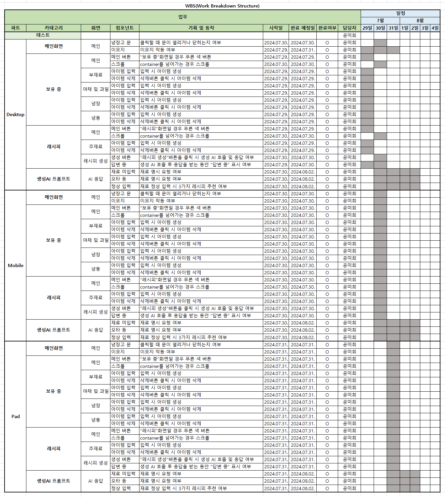
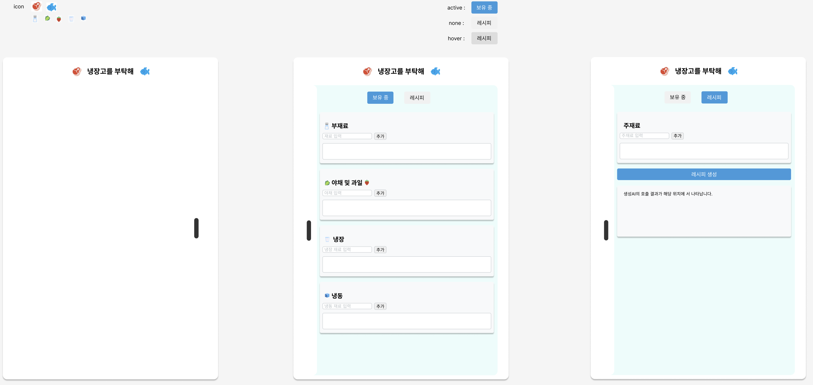

# 06_Plz_Take_care_of_My_Refrigerator

## 프로젝트 목표
- 주재료와 보유 중인 재료를 활용할 수 있는 음식을 추천하고 조리할 수 있는 레시피를 알려주는 서비스 개발
    - 생성AI API를 활용한 레시피 제공 서비스 개발
- 개발된 내용에 대해 문서화 및 배포

## 프로젝트 범위 정의
- 
- 프롬프트 작성
    00 반영한 프롬프트를 설계하는 단계입니다. 

## WBS(Work Breakdown Structure)
### 프로젝트 전체

### 테스트 목록

## Wire Frame(with Figma)

[Link URL](https://www.figma.com/design/Cdv0GO8PKspUcRK69ptrdf/%EB%83%89%EC%9E%A5%EA%B3%A0%EB%A5%BC-%EB%B6%80%ED%83%81%ED%95%B4?node-id=0-1&t=60SudV9UQd35Kd7l-1)

##
[URL](https://heeeee-github.github.io/06_Plz_Take_care_of_My_Refrigerator/)

## 시연 영상

## 사용 기술
### HTML
- 메인 화면
- 사용자가 보유하고 있는 재료 입력란과 확인 필드
    - 카테고리 : 부재료 / 야채 및 과일 / 냉장 / 냉동 
- 요리하려고 하는 주재료의 입력란과 확인 필드
- 레시피 제공을 위한 필드

### CSS
- 레이아웃 : 와이어프레임기반 웹페이지 디자인
- 반응형 디자인 : 화면 크기에 맞는 호환성을 위함
- Loding Indicator : 생성AI 연결 및 답변이 동작 중인지 확인하기 위함

### Java Script
#### 애니메이션
- 냉장고 문 열림/닫힘 효과를 위한 애니메이션
- 냉장고 안 재료 수에 따른 배경 아이콘 생성

#### 화면 전환
- 탭(재료 보유/레시피) 전환 함수

#### 사용자 데이터 입/출력
- 사용자 입력 데이터 로컬 스토리지에 저장/불러오기/업데이트
- 사용자 입력값 중복 체크
- 주재료 상태 확인 및 상태별 결과(구매 필요 여부) 회신

#### 생성AI
- 로컬 스토리지에 저장된 데이터 로드 및 생성AI 호출
- 생성AI 응답 시간 동안 "답변 중"으로 메세지(로딩 표시 요소/아이콘) 표시
- 생성AI 응답 가져오기